❤️Heart Disease Prediction using Neural network from scratch

In this project, we aim to develop a neural network model from scratch (using NumPy) to predict the presence of heart disease based on patient health indicators such as age, cholesterol, blood pressure, and chest pain type.
The goal is to train the model to learn complex relationships between these features and the target outcome — whether a patient is likely to have heart disease — and evaluate its performance on unseen test data.

Before Starting, lets learn what is Neural Network?

A neural network is a computer system that tries to think and learn like the human brain.

It does this by having layers of “neurons” (tiny decision makers) that look at information, pass it along, and slowly learn to make better predictions or decisions.

In math terms:

-> Each neuron takes inputs, multiplies them by weights (how important each input is), adds them up, and passes the result through a function (like a filter).

-> Then, the network adjusts the weights by learning from its mistakes — this process is called training or learning.

A neural network is a model made of many connected layers that can learn to recognize patterns and make decisions — just like the human brain does, but using math instead of biology.

Lets Look this as as story:”The Village of Neurons”

Imagine a small village where every villager has one simple job: to look at a number and pass a message to the next villager.

Each villager:

-> Listens to several neighbors.

-> Decides how much to trust each one (this is the weight).

-> Adds everything up and decides if the message is strong enough to pass along.

At first, the village is clueless. If you ask them to recognize a cat, they make random guesses.

But each time they’re wrong, a teacher comes by and says,

“Hey, you trusted villager A too much and villager B too little.”

So they adjust how much they trust their neighbors. After thousands of tries, they start to get it right — now they can tell if it’s a cat, a dog, or even a car!

Eventually, these villagers (neurons) form teams (layers), with each team focusing on a specific task:

-> The first team looks for simple shapes (edges, colors).

-> The next team looks for patterns (eyes, wheels, ears).

-> The final team says, “Ah, this is a cat!”

That’s how a neural network learns — layer by layer, just like people learn from experience.

Lets start by collecting data:

1.Data Collection

I collected data from kaggle

You can download it by clicking download, it gives a piece of code.

That you can run by installing package of kagglehub

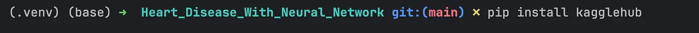

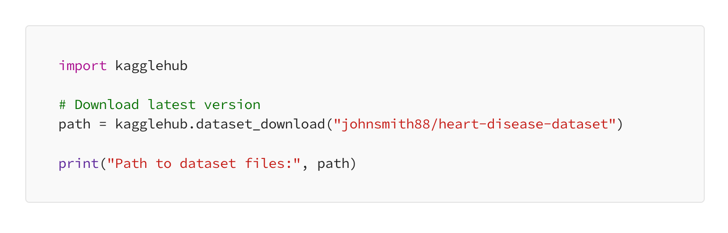

Where you can see a csv file of heart.csv by opening the path

2.Data Loading

For loading the dataset, i am using pandas.What is pandas?

Pandas is an open-source Python library designed for data manipulation and analysis. It provides powerful and flexible data structures, primarily Series and DataFrame, which are well-suited for working with structured data, such as tabular data (like spreadsheets or SQL tables) .

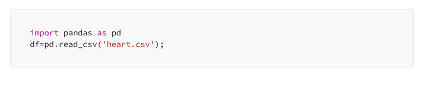

This will create a Dataframe.A Pandas DataFrame is a two-dimensional heterogeneous tabular data structure with labeled axes (rows and columns)

To check the column name we can use

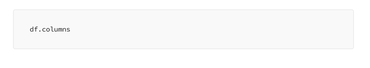

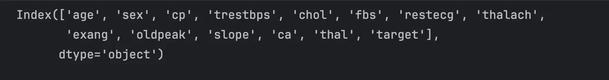

To check the shape of dataset, we can use

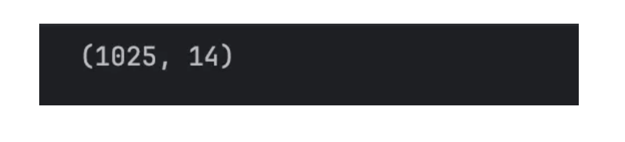

So there are 1025 rows and 14 colums.

Here we are feeding 13 attributes for training.And another attribute is target.

The dataset features and type looks like-

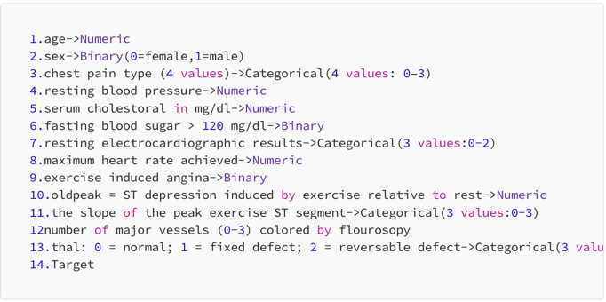

Machines only understands numbers.So we have to check before training.

3.Data Preprocessing

Here for categorical features we can use One Hot Encoding.

One-hot encoding is a technique used in data preprocessing to convert categorical variables into a numerical format that machine learning algorithms can understand.

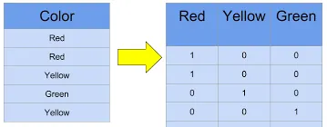

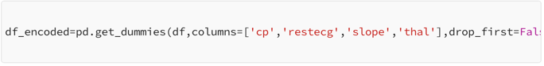

This will create encoded_dataframe.

The columns in df_encoded are

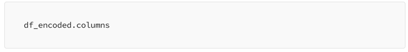

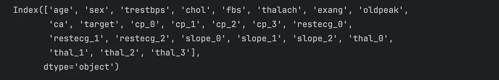

The shape of the encoded_dataframe is

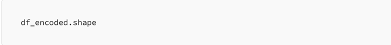

Our 14 features are converted into 24 features.

Seperating Input and Output

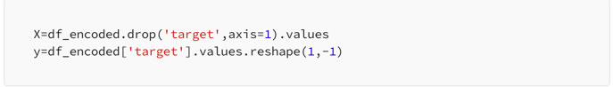

Standardization

It ensures that features with large numeric ranges don’t dominate the learning process.

Centers data around 0 mean and unit variance.

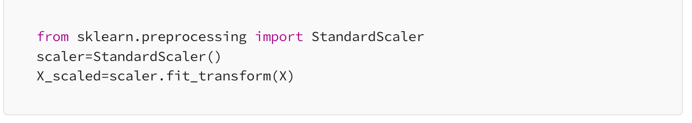

StandardScaler transforms each feature to have:

-> Mean = 0

-> Standard deviation = 1

Train Test Split

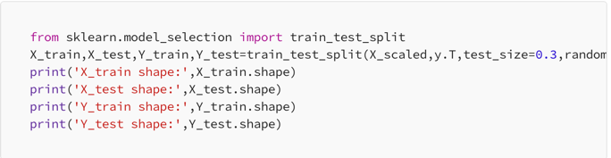

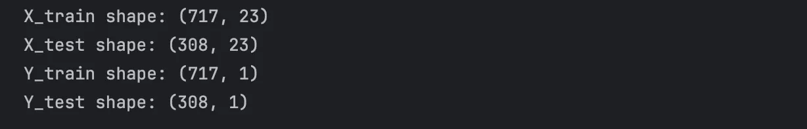

3.Architecture

The Feed_Forward for heart_disease prediction looks like this.

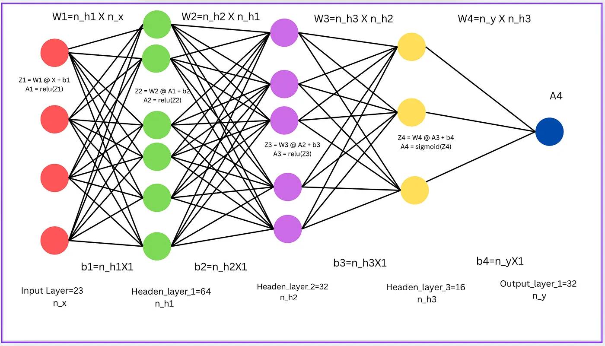

Our network has 4 layers:

1. Input layer (23 features)

2. Hidden layer 1–64 neurons

3. Hidden layer 2–32 neurons

4. Hidden layer 3–16 neurons

5. Output layer — 1 neuron (heart disease: 0 or 1)

Each hidden layer performs two main steps:

1. Linear transformation

This preserve the structure of vector spaces, making them fundamental in many fields for simplifying, analyzing, and manipulating data and systems

Z = W @ A_prev + b

2. Non-linear activation

A = activation(Z)

Activation Functions

Why activation function is used?

Activation functions introduce non-linearity to neural networks, allowing them to learn and model complex patterns beyond simple linear relationships. They are applied to the output of each neuron, determining whether the neuron should be activated or “fire,” and passing the signal to the next layer. Without them, a neural network would simply act as a linear model, severely limiting its capabilities.

1. ReLU

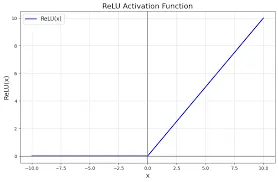

ReLU: ReLU stands for Rectified Linear Unit. It essentially becomes an identity function (y = x) when x ≥ 0 and becomes 0 when x < 0. This is a very widely used activation function because its a nonlinear function and it is very simple.

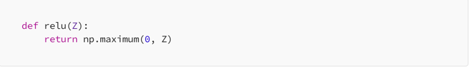

2. Sigmoid

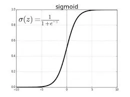

Sigmoid: Sigmoid is essentially a function bounded between 0 and 1. It will become 0 for values which are very negative and 1 for values which are very positive. Hence this function squishes values which are very high or very low to values between 0 and 1. This is useful in neural networks sometimes to ensure values aren’t extremely high or low. This function is usually used at the last layer when we need values which are binary (0 or 1)

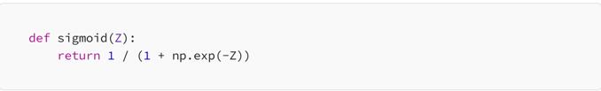

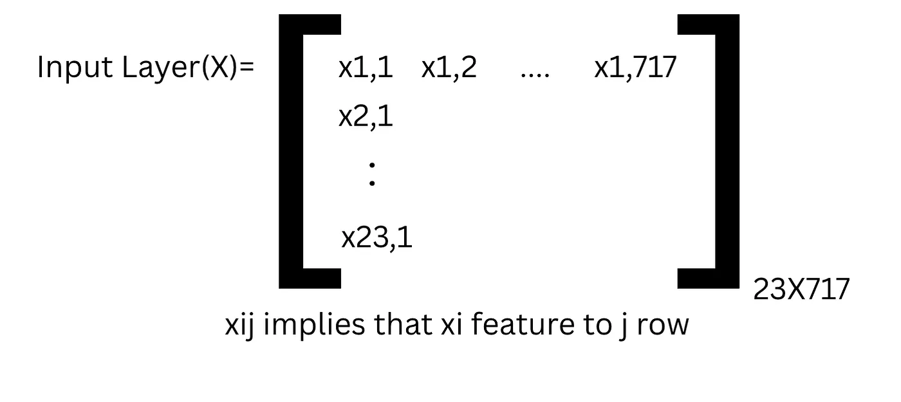

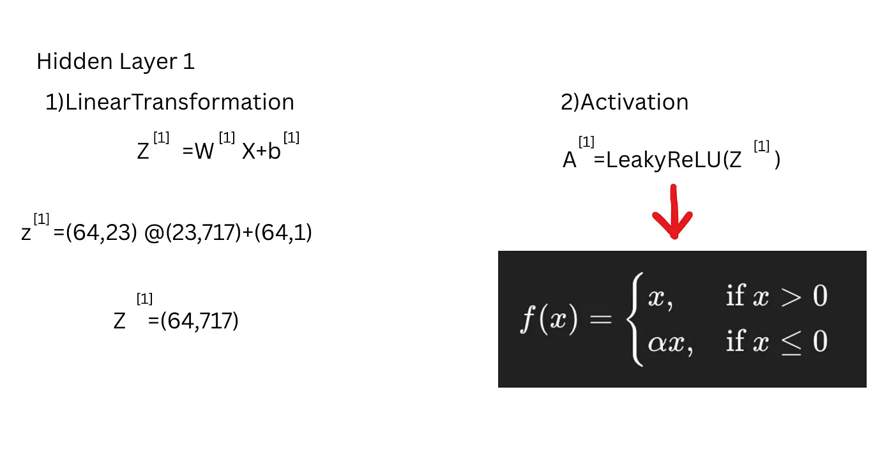

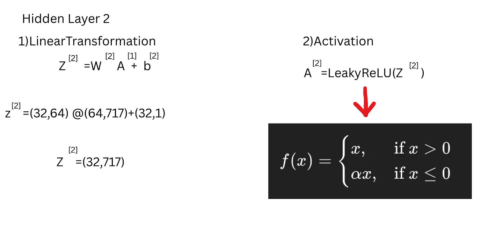

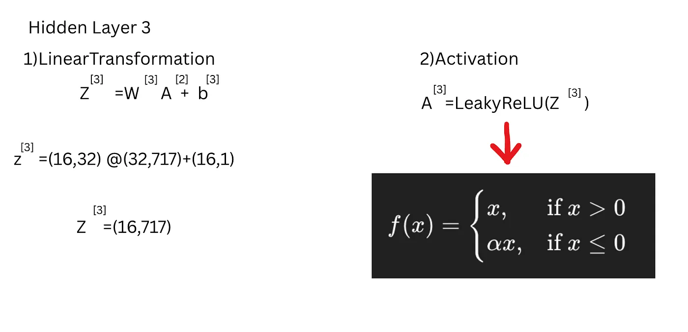

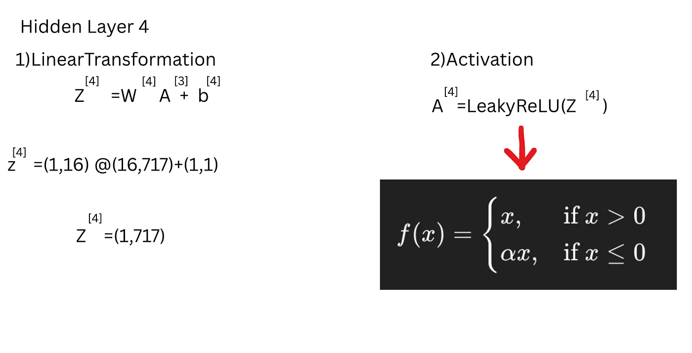

4.Training

Now we can code as above architecture,

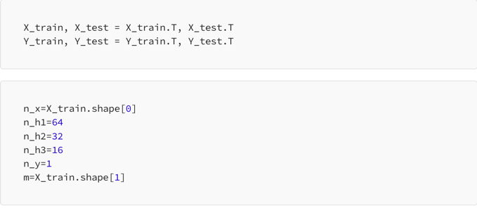

Initialize Weights and bias

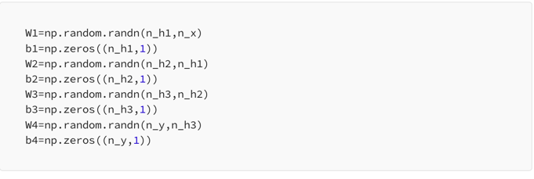

Writing feed_forward as above architecture

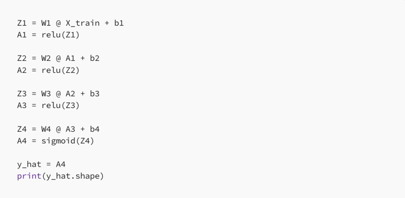

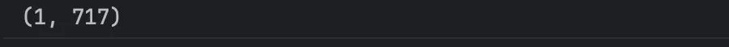

Cost Function

A cost function in a neural network measures the difference between the network’s predicted output and the actual output, providing a single value to quantify the model’s error.

The binary cross-entropy (log loss) cost function used in binary classification problems.

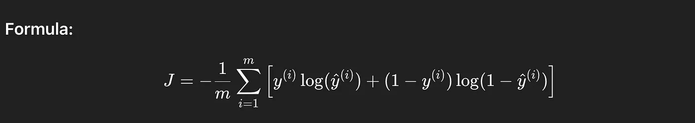

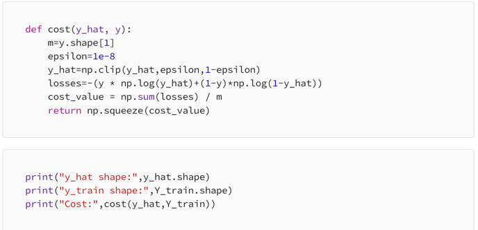

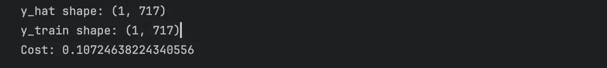

The cost may change one to another because of random weights.

Lets see that our cost function is near to zero, that says that out model is predicting well.But as earlier disscused in story.

At first, the village is clueless. If you ask them to recognize a cat, they make random guesses.
But each time they’re wrong, a teacher comes by and says,

“Hey, you trusted villager A too much and villager B too little.”

So they adjust how much they trust their neighbors. After thousands of tries, they start to get it right — now they can tell if it’s a cat, a dog, or even a car!

So there comes the backpropagation

Backpropagation

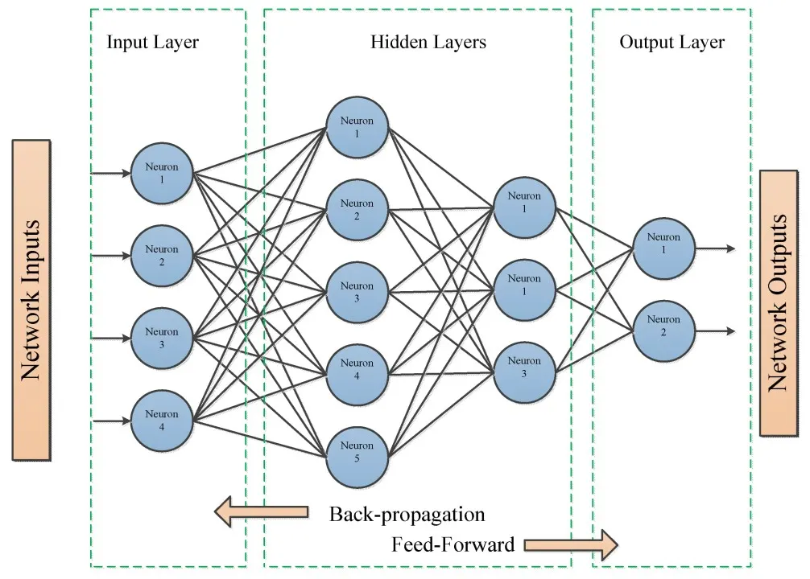

Backpropagation, short for Backward Propagation of Errors, is a key algorithm used to train neural networks by minimizing the difference between predicted and actual outputs. It works by propagating errors backward through the network, using the chain rule of calculus to compute gradients and then iteratively updating the weights and biases.

The goal of backpropagation is to compute the gradients of the cost function J with respect to each parameter Wi and bi:

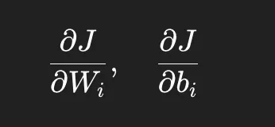

We do this layer by layer, going from output → input.

Step-by-Step Derivations:

Output layer (Layer 4)

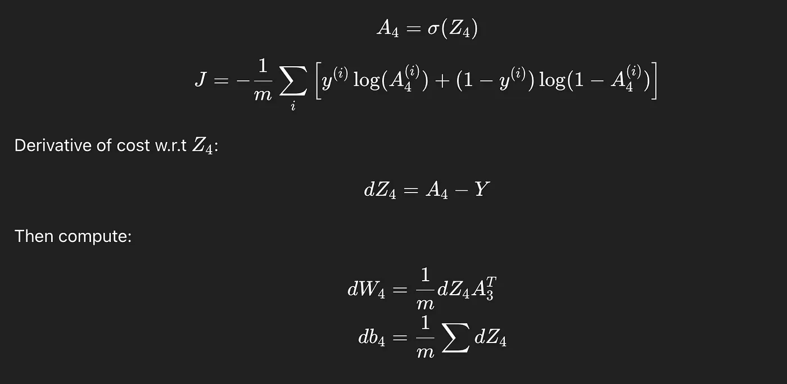

Hidden layer 3

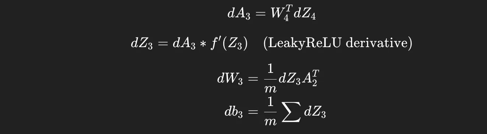

Hidden layer 2

Hidden layer 1

For better accuracy and stability, we used the Leaky ReLU activation function. Leaky ReLU is a modified version of the standard ReLU (Rectified Linear Unit) function, designed to address the “dying ReLU” problem — a situation where neurons stop learning because their gradients become zero.

Unlike standard ReLU, which outputs zero for all negative inputs, Leaky ReLU allows a small, non-zero gradient (controlled by a small slope α) for negative input values. This helps keep the neurons active and improves the flow of gradients during backpropagation.

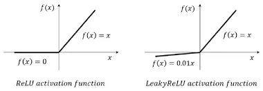

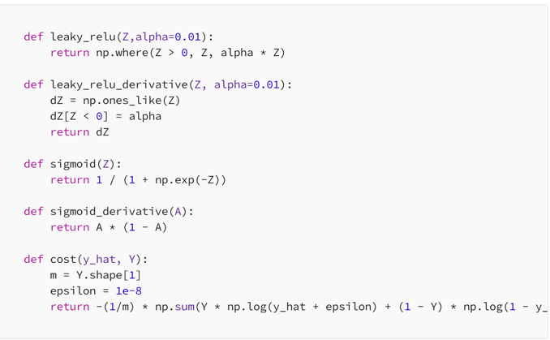

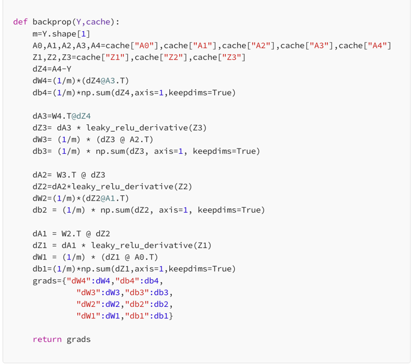

Loss Fuction

A loss function in a neural network quantifies the difference between a model’s predicted output and the true target values, measuring how well the model performs.

-> A loss function measures the error for a single data point, while a cost function calculates the average loss across the entire dataset.

Accuracy

Accuracy in a neural network is a metric that measures the percentage of correct predictions made by the model. It is calculated by dividing the number of correct predictions by the total number of predictions.

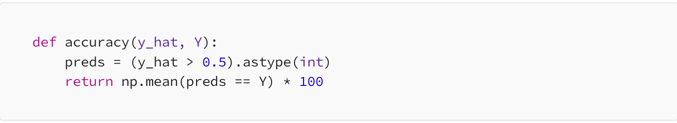

Train function

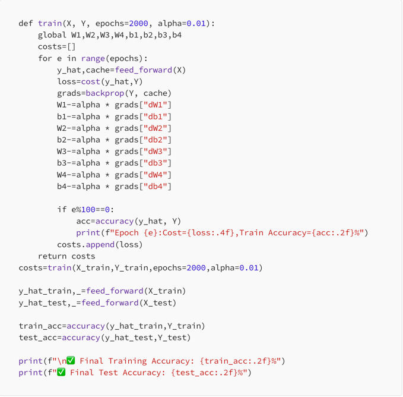

The final result we can get is

Epoch 0: Cost = 0.1076, Train Accuracy = 97.63%
Epoch 100: Cost = 0.1011, Train Accuracy = 97.77%
Epoch 200: Cost = 0.0951, Train Accuracy = 97.77%
Epoch 300: Cost = 0.0894, Train Accuracy = 97.77%
Epoch 400: Cost = 0.0840, Train Accuracy = 97.77%
Epoch 500: Cost = 0.0789, Train Accuracy = 98.05%
Epoch 600: Cost = 0.0742, Train Accuracy = 98.05%
Epoch 700: Cost = 0.0698, Train Accuracy = 98.05%
Epoch 800: Cost = 0.0655, Train Accuracy = 98.19%
Epoch 900: Cost = 0.0615, Train Accuracy = 98.61%
Epoch 1000: Cost = 0.0577, Train Accuracy = 98.61%
Epoch 1100: Cost = 0.0542, Train Accuracy = 98.61%
Epoch 1200: Cost = 0.0507, Train Accuracy = 98.88%
Epoch 1300: Cost = 0.0472, Train Accuracy = 99.30%
Epoch 1400: Cost = 0.0438, Train Accuracy = 99.30%
Epoch 1500: Cost = 0.0407, Train Accuracy = 99.30%
Epoch 1600: Cost = 0.0379, Train Accuracy = 99.58%
Epoch 1700: Cost = 0.0354, Train Accuracy = 99.58%
Epoch 1800: Cost = 0.0331, Train Accuracy = 99.58%
Epoch 1900: Cost = 0.0310, Train Accuracy = 99.58%

✅ Final Training Accuracy: 99.58%
✅ Final Test Accuracy: 96.75%

We successfully built a heart disease prediction model completely from scratch — without using any deep learning libraries like TensorFlow or PyTorch. By manually implementing forward propagation, backpropagation, and gradient descent, we not only achieved a strong Training Accuracy of 99.58% and Test Accuracy of 96.75%, but also gained a deep understanding of how a neural network actually learns.

This project shows that with just NumPy and a solid grasp of math, you can create powerful predictive models from the ground up

If you found this helpful or learned something new, I’d really appreciate it if you share this article with others — it took quite a bit of time and effort to put together .

Thanks for reading and for better accuracy or further improvements, you can try using more hidden layers or neurons to capture complex patterns.